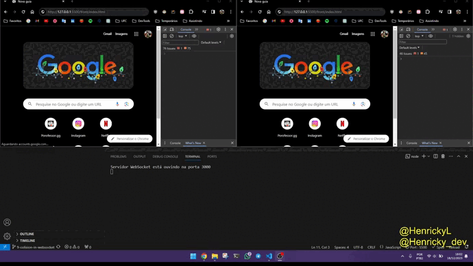

# Game Engine Js

Este projeto teve como estopim o projeto final do curso da [ADA - vem ser Tech - ifood](https://github.com/HenrickyL/ADA-Ifood). Com a seguinte descrição.

----------------
**Tema do Exercício: Desenvolvimento de Jogo com Programação Orientada a Objetos em JavaScript**

**Requisitos:**

1. Criar um jogo simples que envolva personagens, inimigos e itens.
2. Cada personagem pode interagir com inimigos, coletar itens e ganhar pontos.
3. Cada inimigo tem diferentes níveis de dificuldade e oferece uma quantidade variável de pontos ao ser derrotado.
4. O jogo deve permitir a movimentação dos personagens no ambiente e detectar colisões entre eles.
5. Implementar métodos para calcular a pontuação do jogador, exibir informações relevantes e controlar o estado do jogo (iniciado, pausado, concluído).

**Classes:**

1. Personagem: Representa um personagem do jogo. Atributos: nome, pontuacao, posicao.
   * Métodos: mover(direcao), coletarItem(item), derrotarInimigo(inimigo), calcularPontuacao().
2. Inimigo: Representa um inimigo do jogo. Atributos: tipo, nivelDificuldade, pontos.
3. Item: Representa um item que pode ser coletado pelos personagens. Atributos: nome, pontos.
4. Jogo: Representa o estado geral do jogo. Atributos: personagens, inimigos, itens, estado (iniciado, pausado, concluído).
   * Métodos: iniciarJogo(), pausarJogo(), concluirJogo().
---------------

Porém como no segundo semestre de 2023 estive fazendo e incrementando uma [Engine de jogos em C++](https://github.com/HenrickyL/game-engine-2d-cpp) para meu TCC, acabei por fazer uma pequena engine utilizando

* Canvas
* Javascript

O que foi muito divertido de fazer.


## directories:

### Front

1. `Engine`: Todo o código em si
2. `Game`: Todo o código específico do game (**O que deve ser avaliado**)
3. `Errors`: Algumas classes para tratar erros
4. `index.html` - onde chama o código base
5. `index.js` - onde o código base é chamado

```js
//index.js 
import { Engine } from "./Engine/Engine.js"
import { Game } from "./Game/Game.js"

window.addEventListener('load', ()=>{
    const engine = new Engine()
    const game = new Game();
    engine.start(game)
})
```
#### How to Run?
- open `index.html` with live server of vscode

### Server

em construção...

### How to Run?

- `cd server`
- `npm start`

Tentativa de encontrar 2 jogadores para jogar o game usando **WebSocket**


## DEMO - Ping Pong

